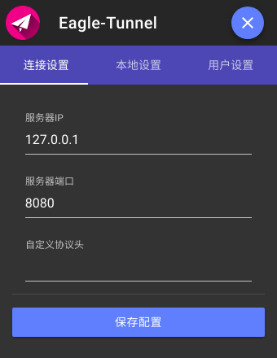
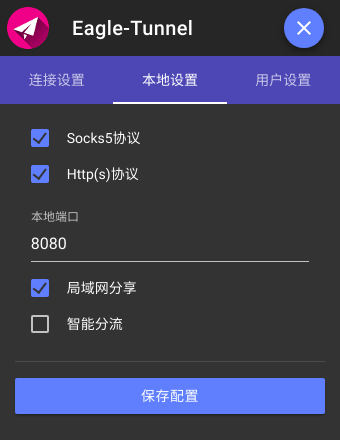
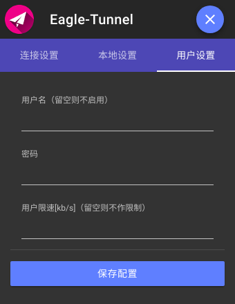
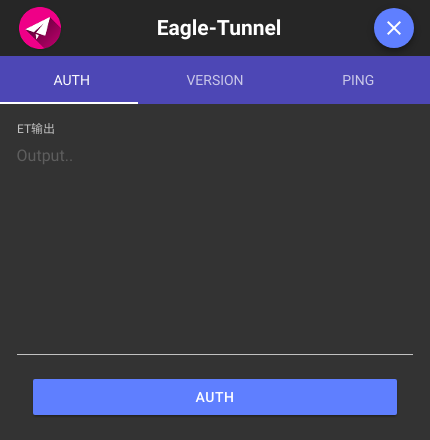
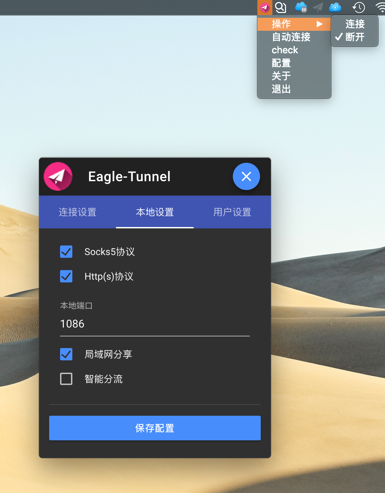

# ET-electron

 Eagle Tunnel with GUI for Linux and Windows

基于：[eagle.tunnel.go](https://github.com/eaglexiang/eagle.tunnel.go)开发

前端基于[MDUI](https://github.com/zdhxiong/mdui)

~~由两个只会写C++、对js基本0基础的学生用electron花了一天半编写~~

好吧到现在为止已经不止一天半了QwQ...

# 安装

请去Releases里下载自己系统对应的软件压缩包。

解压即可

现阶段支持的系统：

+ Linux 64/32 位
+ Windows 64/32 位
+ mac

# 更新

请去Releases里下载最新版的软件压缩包

解压并覆盖原来的目录即可

之前的配置文件将不会丢失

# 使用

## 启动程序

+ Linux : 双击打开`et-electron`
+ Windows : 双击打开`et-electron.exe`
+ Mac : 双击打开`et-electron.app` 建议启动后，可以在dock里面选择'登录时打开'，默认每次自动开启

启动程序后程序将默认后台运行，您可以在系统托盘图标中找到它。

## 配置设置

点击托盘图标

在弹出来的菜单中选择“配置”。

配置界面将会弹出。

接着按您的服务器配置设置您的程序配置即可。

保存配置后连接会自动重启，无需断开重连

## 连接/断开服务器

点击托盘图标。

在弹出来的菜单中选择“操作 => 连接/断开”即可。

## 自动连接

点击托盘图标。

在弹出来的菜单中勾选“自动连接”，这样在下次程序启动时会自动根据您的配置连接服务器。

这样您就可以将ET-electron设为开机启动项后自动开启服务了。

Windows系统设置开机启动项可以用注册表添加

Linux系统设置开机启动项可以在首选项->启动应用程序中添加

## 测试服务(check)

这个功能可以用于测试et服务是否工作正常，或者更轻松地判断问题所在之处。

点击托盘图标。

在弹出来的菜单中单击“check”

用于调用内建的检查指令的图形化界面将会弹出。

在界面中你将会看到“AUTH,VERSION,PING”三个TAB分页。

单击“AUTH”按钮将会调用内建指令：`[et.go] check auth -c [client.conf]`

单击“VERSION”按钮将会调用内建指令：`[et.go] check version -c [client.conf]`

单击“PING”按钮将会调用内建指令：`[et.go] check ping -c [client.conf]`

调用指令的返回结果将会在界面中的“ET输出”文本框内实时显示。

## 查看程序及内核版本

点击托盘图标。

在弹出来的菜单中单击“关于”

弹出的信息框将显示程序的版本，并调用`[et.go] -v`命令实时显示et内核版本

# 截图

# 鸣谢

感谢[eaglexiang](https://github.com/eaglexiang/eagle.tunnel.go/commits?author=eaglexiang)大佬开发的[eagle.tunnel.go](https://github.com/eaglexiang/eagle.tunnel.go)项目，没有这个项目便没有ET-electron。~~这不是废话吗~~

感谢[electron项目](https://github.com/electron/electron)，没有这个项目作者便不会接触到js。

感谢[MDUI项目](https://github.com/zdhxiong/mdui)，提供了美观的前端框架以及详细的开发文档。

# 打赏

+ 微信：作者没有
+ 支付宝：作者也没有
+ 倒是可以去[作者博客](https://www.mina.moe/)串串门QwQ
